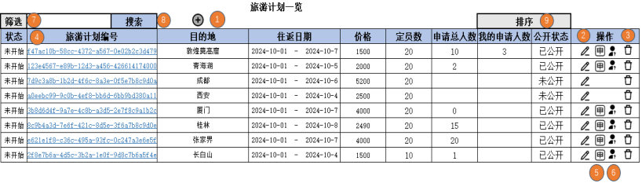
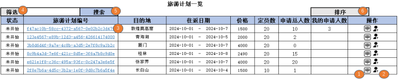
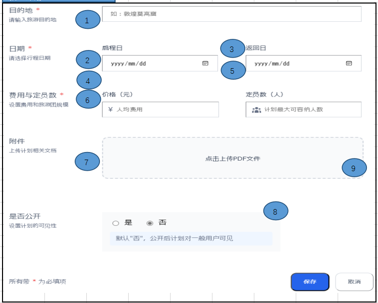
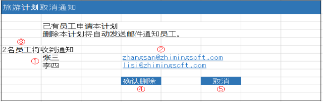
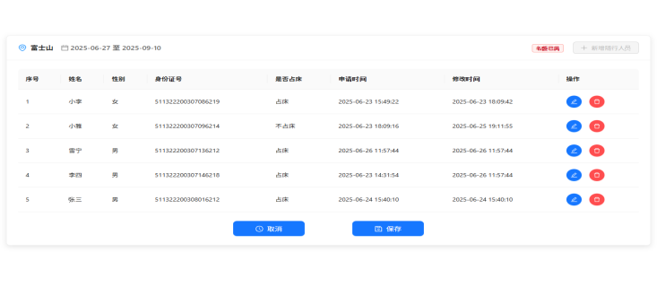
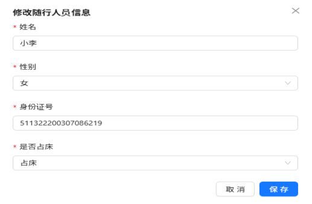
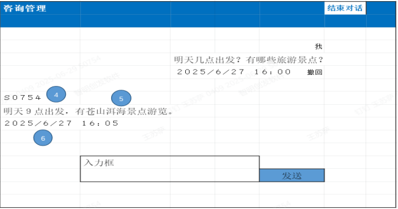
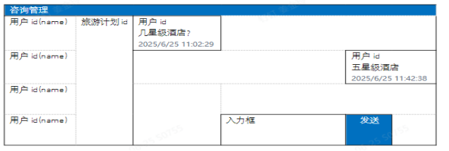

# 公司旅行管理系统要件定义书

## 1.概要

本系统是一个用于管理和申请公司内部旅行计划的网络应用程序。
员工可以利用本系统进行旅行计划的登录、浏览和申请。

## 2.功能需求

### 2.1.用户登录

用户认证使用预先准备好的用户数据库。用户通过登录界面输入员工编号和密码进行认证。用户注册功能不包含在本系统中。提供用户密码修改功能。用户登录成功后显示旅游计划一览画面。

管理员登陆后显示界面如下图：
（登陆后显示了旅游计划表，包括状态、旅游计划编号、目的地、往返日期、价格、定员数、申请总人数、我的申请人数、公开状态、操作（操作这里包括四个按钮：编辑旅游计划按钮、申请、咨询按钮、删除计划按钮），旅游计划表上方有筛选、搜索、添加旅游计划按钮、排序按钮）

旅游计划编号这列的内容可以点击，这里存储的是旅游计划pdf，点击后打开旅游计划pdf。



用户登陆后显示界面如下图：
相较于管理员少了添加旅游计划按钮、编辑旅游计划按钮、删除计划按钮。旅游计划表里不显示公开状态这一列。



### 2.2.旅行计划新建、修改、删除

拥有管理员权限的用户可以新建旅行计划、修改和删除现有计划。旅行计划中可以设置目的地、日程、价格、定员、附件、是否公开等项目。

管理员点击新建旅行计划显示界面如下图：

管理员点击编辑旅游计划按钮时显示类似下图，但是需要将该旅游计划的内容填充进去。

图片中带*的是必填项



管理员点击删除旅行计划后需要判断是否有员工申请计划，没有则直接删除，有了就显示哪些员工申请了，通知员工、确认删除和取消这三个按钮。




### 2.3.旅行计划申请

用户可以浏览公开的旅行计划并进行申请。在申请时，可以指定人数、选项等详细信息。一旦申请的计划，允许取消或更改（人数、选项）。

添加和修改人数的界面如下图：



点击修改人员信息按钮后显示如下图：



### 2.4.计划查询和PDF输出

用户可以查看自己已申请的计划列表，确认各个计划的详细信息，并且可以导出为PDF进行打印。

### 2.5.咨询

用户可以针对每个旅行计划发布咨询内容（点击咨询按钮），并查看管理员的回答，界面如下：



管理员可以回复普通用户，界面如下：



## 3.非功能性需求

### 3.1.可用性

用户界面应采用简单易懂的设计。为提高操作性，适当显示提示和错误信息。

### 3.2.性能

平均响应时间应在3秒以内。同时访问高峰时的最大处理能力为500请求/秒。

### 3.3.安全性

实施用户认证、输入值的安全检查和通信加密。采取措施防止外部的不正当访问。

### 3.4.扩展性

考虑未来的功能扩展，采用模块化架构。设置日志记录和监控功能。

## 4.开发语言/环境

前端：使用JSP、Javascript开发网页
后端：基于SpringBoot框架的Java开发
数据库：使用MySQL
存储：使用对象存储保存附件（如PDF等）

## 5.依赖版本

依赖的版本按照下面的

```
 <dependency>
            <groupId>javax.servlet</groupId>
            <artifactId>javax.servlet-api</artifactId>
            <version>4.0.1</version>
            <scope>provided</scope>
        </dependency>
<!--        jsp-->
        <dependency>
            <groupId>javax.servlet.jsp</groupId>
            <artifactId>javax.servlet.jsp-api</artifactId>
            <version>2.3.3</version>
            <scope>provided</scope>
        </dependency>

        <dependency>
            <groupId>javax.servlet</groupId>
            <artifactId>jstl</artifactId>
            <version>1.2</version>
        </dependency>
```